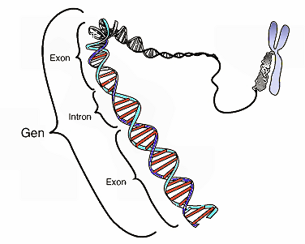
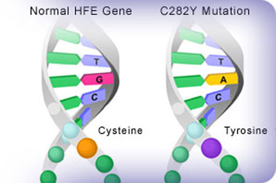
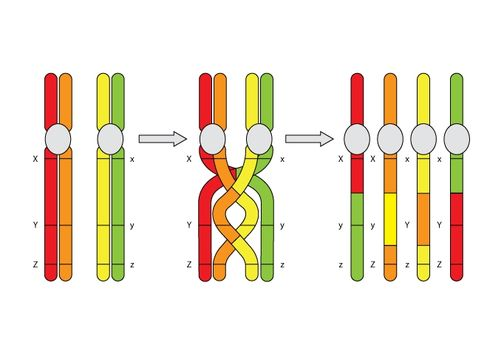
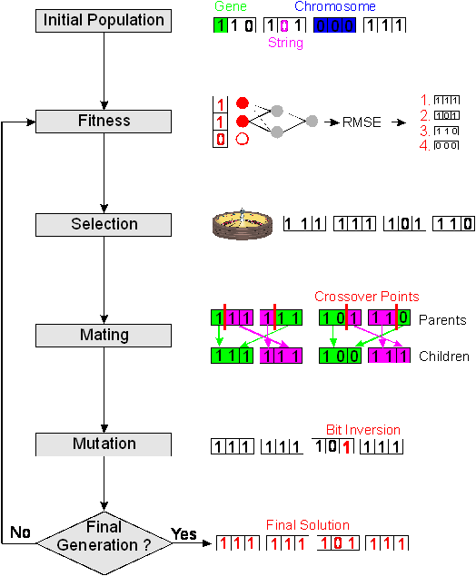

# Genetic Algorithm

Introduction of genetic algorithm.

Thomas Volk

---

## What is a Gene?

## What is Mutation?

## What is crossing over?

## Genetic Algorithm Requirements

* Es muss relativ einfach sein eine potentiell gute Lösung von einer schlechteren zu unterscheiden

* Eine potentielle Lösung muss sich in unabhängige Teile zerlegen lassen

* Es muss nicht immer die optimal Lösung gefunden werden, eine gute Lösung kann genügen 

# Appendix

## Links

* the example: https://github.com/thomasvolk/genetic-algorithm-example
* JGAP: http://jgap.sourceforge.net/

## Creating Slides

Install markdown-to-slides:

    sudo npm install markdown-to-slides -g

Create the slides with markdown-to-slides:

    markdown-to-slides README.md > README.html

View them with your browser:

    firefox README.html

see: https://github.com/partageit/markdown-to-slides
